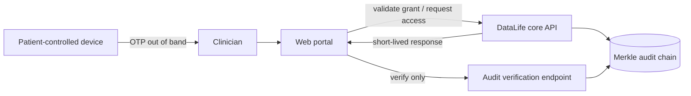

# DataLife Web Portal

> A privacy-conscious consultation and audit console for the DataLife e-Health ecosystem.

[](LICENSE)
[](#project-status)
[](CONTRIBUTING.md)

`datalife-web-portal` is the planned clinician-facing web client for
[DataLife e-Health](https://github.com/datalife-ehealth). It will provide narrow,
auditable workflows for patient-authorized access, emergency access, and ledger
verification without turning the browser into a second health-record system.

> [!IMPORTANT]
> This repository currently contains the project contract and community scaffold;
> it does **not** yet contain a runnable web application. It is research software,
> not a certified EHR or medical device, and must not be used for clinical care.

## Project status

**Scaffold / implementation lead wanted.** The system boundary and integration
points below are ready for design review. Framework bootstrapping and product code
should begin in a focused RFC or issue before a large pull request.

## Scope

### This repository owns

- the clinician consultation experience;
- patient OTP entry and validation UX;
- the reason-capture and confirmation UX for glass-break access;
- a read-only integrity view for the tamper-evident audit chain; and
- browser-side session hygiene, accessibility, and safe error handling.

### This repository does not own

- patient identity storage or the patient-controlled PII vault;
- OTP issuance, authorization policy, or physician verification;
- clinical payload persistence, cryptographic audit primitives, or API policy;
- diagnosis, treatment recommendations, billing, or hospital operations; or
- a replacement for the core service's authorization checks.

Those server-side responsibilities remain in
[`datalife-datalake-core`](https://github.com/datalife-ehealth/datalife-datalake-core).

## Intended architecture



The portal is an untrusted client. Every authorization decision must be repeated by
the core API. Access tokens and clinical responses must remain memory-only wherever
possible and must never be written to logs, analytics, URLs, or persistent browser
storage.

## Core API dependency

The current core reference implementation exposes:

| Workflow | Method and path | Portal responsibility |
|---|---|---|
| Validate a patient grant | `POST /api/v1/access/otp/validate` | Submit the token and opaque `subject_key`; handle `valid: false` without leaking details. |
| Request emergency access | `POST /api/v1/access/glass-break` | Require an explicit reason and show that the event remains `UNCONFIRMED`. |
| Verify audit integrity | `GET /api/v1/audit/verify` | Present verification state and chain height without claiming independent consensus. |

The core does **not** currently expose a clinical-payload retrieval contract. This
portal must not invent or bypass that boundary. A versioned, authorized read API
and its threat model must be agreed upstream before record-viewing UI is connected.

## Proposed technical direction

- TypeScript with React and Next.js
- TanStack Query for server state
- Tailwind CSS with an accessible component foundation
- schema-generated API types once the core OpenAPI contract is stabilized
- unit, accessibility, contract, and end-to-end tests in CI

These are design constraints, not installed dependencies yet. Changes to the trust
boundary require an RFC; implementation details can evolve through normal review.

## Security and privacy invariants

- Never collect or persist names, CPF/tax identifiers, phone numbers, or emergency
  contacts in this repository's services.
- Treat `subject_key`, OTPs, physician identifiers, access reasons, and clinical
  content as sensitive even when they are pseudonymous.
- Do not place sensitive values in telemetry, crash reports, query strings, or
  client-side persistence.
- Render all clinical content as hostile input; prevent script, Markdown, and file
  preview injection.
- Do not describe the audit chain as a blockchain. It is a deterministic,
  tamper-evident Merkle chain within one administrative boundary.

See [SECURITY.md](SECURITY.md) for private vulnerability reporting.

## Getting started

There is no application runtime to install yet. To help shape the first milestone:

```bash
git clone https://github.com/datalife-ehealth/datalife-web-portal.git
cd datalife-web-portal
```

Then read [CONTRIBUTING.md](CONTRIBUTING.md), review the boundary above, and propose
a small, testable first slice. Good first milestones include an accessible shell,
an OpenAPI client generation spike, or a mocked OTP-validation flow using synthetic
identifiers only.

## Stewardship and contact

| Area | Channel |
|---|---|
| Repository steward and review | [@FinalSunFlower](https://github.com/FinalSunFlower) via GitHub issues or pull requests |
| Implementation lead | Open — use the organization contribution-task template to propose ownership |
| Architecture and core API | [`datalife-datalake-core`](https://github.com/datalife-ehealth/datalife-datalake-core/issues) |
| Security disclosure | Follow [SECURITY.md](SECURITY.md); do not open a public issue |
| General support | See [SUPPORT.md](SUPPORT.md) |

Please follow the organization-wide
[contribution guide](https://github.com/datalife-ehealth/.github/blob/main/CONTRIBUTING.md)
and [Code of Conduct](https://github.com/datalife-ehealth/.github/blob/main/CODE_OF_CONDUCT.md).

## License

Copyright (c) 2026 Luchang Jiang. Released under the [MIT License](LICENSE).
